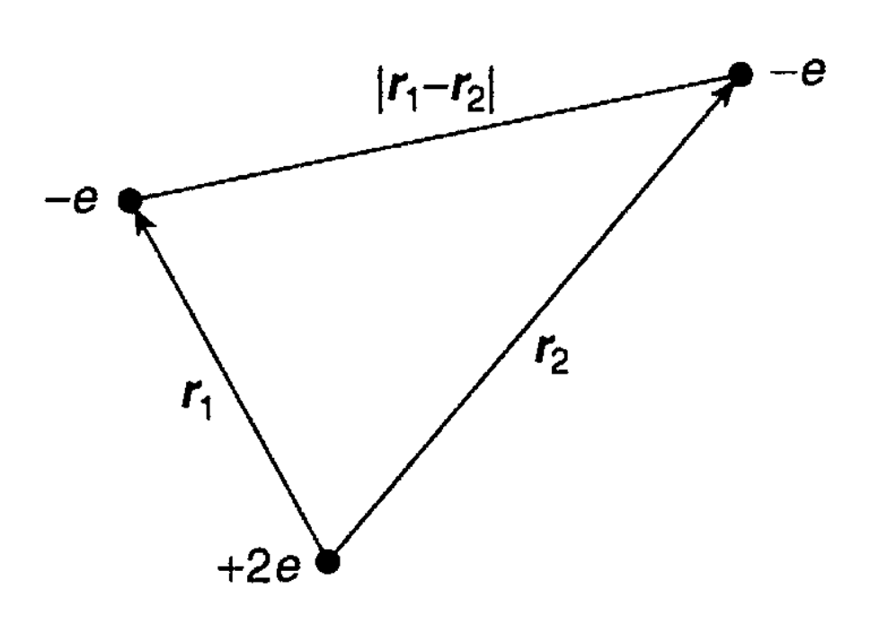

# Teori

Varyasyon ilkesi bir sisteme ait olan minimum enerji durumlarını belirlemeyi amaçlar. Bunun için bir ``deneme fonksiyonu'' $| \psi \rangle$ belirlenir ve sistemin bilinen hamiltonyenine uygulanır.

::: {.block}
## Varyasyon ilkesi
$$ \langle H \rangle = \frac{\langle \psi | H | \psi \rangle}{\langle \psi | \psi \rangle} \ge E_{0} $$
:::

Uygulanan her farklı $\psi$ için hamiltonyenin beklenen değeri değişir. Belirlenen $\psi$ belirli parametreler üzerinden optimize edilerek, sistemin mevcut olan minimum enerji seviyesinin bulunması amaçlanır.

# Varyasyon ilkesinin harmonik salınıcıya uygulanması

::: {.block}
## Harmonik salınıcıya ait hamiltonyen
$$ H = -\frac{\hbar^{2}}{2m}\frac{d^{2}}{dx^{2}} + \frac{1}{2}kx^{2} $$
:::

Varyasyon ilkesi, deneme fonksiyonu $\psi=e^{-\alpha x^{2}}$ ve $\alpha > 0$ optimizasyon parametresi olmak üzere harmonik salınıcıya uygulanırsa:

::: {.block}
##
\vspace{-0.3em}
$$ \langle H \rangle (\alpha) = \frac{\langle \psi_{\alpha} | H | \psi_{\alpha} \rangle}{\langle \psi_{\alpha} | \psi_{\alpha} \rangle} = \frac{\hbar^{2}}{2m}\alpha + \frac{1}{8}k x^{2} \frac{1}{\alpha} $$
:::

olarak bulunur.

#

$\langle H \rangle(\alpha)$ fonksiyonu'nun $\alpha$ parametresine göre türevi alınacak olunursa sonuç:

::: {.block}
##
$$\frac{d}{d\alpha}\langle H \rangle (\alpha) = \frac{\hbar^{2}}{2m} - \frac{1}{8}k x^{2} \frac{1}{\alpha^{2}} $$
:::
olarak bulunur. Bu sonucun minimum değeri olan $0$'a eşitlenecek olursa, $\alpha_{0}=\frac{1}{2}\frac{\sqrt{km}}{\hbar}$ olarak bulunur. Bulunan $\alpha_{0}$ değeri $\langle H \rangle (\alpha)$ denkleminde yerine yazılırsa:

::: {.block}
##
$$\langle H \rangle (\alpha_{0})=\frac{1}{2}\hbar\sqrt{\frac{k}{m}} $$
:::
olarak bulunur. Bu sonuç harmonik salınıcının bilinen minimum enerji durumudur.

# Varyasyon ilkesinin farklı dalgafonksiyonları ile denenmesi

Bu sefer $\psi=\frac{1}{x^{2} + \alpha}$ ve $\alpha > 0$ olarak seçersek:

::: {.block}
##
$$ \langle H \rangle (\alpha) = \frac{\hbar^{2}}{4m}\frac{1}{\alpha} + \frac{1}{2}k^{2}\alpha \quad \text{olarak bulunur.}$$
:::
\vspace{-0.5em}
Bulunan $\langle H \rangle (\alpha)$ değerinin türevi alınacak olunursa:

::: {.block}
##
\vspace{-1.2em}
$$\frac{d}{d\alpha}\langle H \rangle (\alpha) = -\frac{\hbar^{2}}{4m}\frac{1}{\alpha^{2}} + \frac{1}{2}k^{2} \quad \text{ve} \quad \alpha_{0}=\frac{1}{\sqrt{2}}\frac{\hbar}{m}\sqrt{\frac{k}{m}} \quad \text{olarak bulunur.} $$
:::
\vspace{-0.5em}
Bulunan $\alpha_{0}$ değerini hamiltonyendeki yerine yazacak olursak: 

::: {.block}
##
$$\langle H \rangle (\alpha_{0})=\frac{1}{\sqrt{2}}\hbar\sqrt{\frac{k}{m}} \quad \text{olarak bulunur.}$$ 
:::
\vspace{-0.5em}
Bu, verilen $\psi$ için bulunan minimum beklenen değerdir ve bilinen minimum değerin $\sqrt{2}$ katıdır.

# Helyum atomunun taban durumu

Helyum atomu çekirdek etrafındaki yörüngede bulunan iki elektrondan oluşur. Helyum atomuna ait Hamiltonyen aşağıdaki şekildedir:

::: {.block}
## Helyum atomuna ait hamiltonyen
$$ H  = - \frac{\hbar^{2}}{2m} \Big(\nabla _{1}^{2}+\nabla _{2}^{2}\Big)  - \frac {e^{2}}{4\pi \epsilon _{0}}\bigg(\frac{2}{r_{1}} + \frac{2}{r_{2}} - \frac{1}{|{\vec{r_{1}}}-{\vec{r_{2}}}|}\bigg) $$
:::

:::::::::::::: {.columns}
::: {.column width="30%"}
\vspace{-0.7em}
::: {.block}
##
{ width=100% }

\vspace{-0.5em}
:::
:::
::: {.column width="65%"}

Problemimiz taban enerji durumu olan $E_{1}$'yi hesaplamak. Bu enerji  iki elektronu da yörüngeden çıkarmak için gerekli olan enerjidir. Helyum atomunun taban enerji seviyesi deneysel olarak şu şekilde bulunmuştur:

::: {.block}
##
\vspace{-0.5em}
$$ E_{1} = -78.975 \text{eV (deneysel ölçüm)} $$
:::

:::
::::::::::::::

#

Hamiltonyeni parçalara ayırıp incelersek hamiltonyenin, yörüngesel kinetik enerji, coulomb potansiyeli ve elektron-elektron etkileşimi olmak üzere üç kısımdan oluştuğunu görürüz.

::: {.block}
##
\vspace{-0.5em}
$$ H  = \underbrace{- \frac{\hbar^{2}}{2m} \bigg(\nabla _{1}^{2}+\nabla _{2}^{2}\bigg) }_{\text{Yörüngesel kinetik enerji}}
- \underbrace{\frac {e^{2}}{4\pi \epsilon _{0}}\bigg(\frac{2}{r_{1}} + \frac{2}{r_{2}} \bigg)}_{\text{Coulomb potansiyeli }} 
+ \underbrace{\frac {e^{2}}{4\pi \epsilon _{0}}\bigg(\frac{1}{|{\vec{r_{1}}}-{\vec{r_{2}}}|}\bigg)}_{\text{Elektron-elektron etkileşimi}} $$
:::
Eğer elektron-elektron etkileşimini göz ardı edecek olursak sisteme ait dalgafonksiyonu iki hidrojen atomunun birleşimi olarak yazılabilir. \newline
Not:*Bunu yaparken çekirdeğe ait nükleer yük $e \rightarrow 2e$ olarak değiştirilmelidir.*

::: {.block}
##
$$ \psi_{0}(\vec{r_{1}},\vec{r_{2}}) \equiv \psi_{100}(\vec{r_{1}})\psi_{100}(\vec{r_{2}}) 
= \frac{8}{\pi a_{0}^{3}} e^{-2 (r_{1} + r_{2})/a_{0}} $$
:::

#

Helyum atomunun hamiltonyenini iki kısım halinde genelleyebiliriz; Elektron-elektron etkileşimi ve elektron-çekirdek etkileşimi. Elektron-elektron etkileşimini şimdilik gözardı edersek sistemin geri kalanı $8E_{1}$ olarak yazılabilir. Ve sistemin hamiltonyeni:

::: {.block}
##
\vspace{-1em}
$$ E_{1} = \frac{1}{\pi a_{0}^{3}} e^{-2 (r_{1} + r_{2})/a_{0}} = -13.6\text{eV} \quad \text{olmak üzere} \quad H = 8E_{1} + V_{ee} $$
:::
\vspace{-0.5em}
olarak yazılabilir. Son olarak elektron-elektron etkileşimi hesaplanırsa:

::: {.block}
##
\vspace{-1em}
$$ \langle V_{ee} \rangle 
= \bigg(\frac{e^{2}}{4 \pi \epsilon_{0}} \bigg) \bigg( \frac{8}{\pi a_{0}^{3}} \bigg)^{2} \int \frac{e^{-4 (r_{1} + r_{2})/a_{0}}}{|{\vec{r_{1}}}-{\vec{r_{2}}}|} d^{3} \vec{r_{1}} d^{3} \vec{r_{2}} 
= - \frac{5}{2} E_{1} 
= 34\text{eV} $$
:::
\vspace{-0.5em}
olarak bulunur.

Bulunan bütün değerler toplanırsa, sistemin enerjisi -75eV olarak bulunur. 

::: {.block}
##
\vspace{-0.5em}
$$ \langle H \rangle = 8 E_{1} + \langle V_{ee} \rangle \quad \rightarrow \quad \langle H \rangle = -109 \text{eV} + 34 \text{eV} =  -75 \text{eV} $$
:::

# Hamiltonyenin parametrize edilmesi

Fakat hala deneysel ölçüm olan -79 eV'dan uzaktayız. Daha gerçekçi bir sonuç bulmak için bir deneme keti belirleyelim.

::: {.block}
##
$$ \psi_{1} (\vec{r_{1}},\vec{r_{2}}) \equiv \frac{Z^{3}}{\pi a_{0}^{3}} e^{-Z (r_{1} + r_{2})/a_{0}} $$
:::

Buradaki $Z$ varyasyon parametresidir ve $\langle H \rangle$ değerini minimize etmek için kullanılacaktır.

Hamiltonyeni belirlediğimiz $Z$ parametresine göre yazacak olursak:

::: {.block}
## Z parametresine göre belirlenmiş helyum hamiltonyeni
\vspace{-1em}
$${\textstyle H  = - \frac{\hbar^{2}}{2m} \Big(\nabla _{1}^{2}+\nabla _{2}^{2}\Big)  - \frac {e^{2}}{4\pi \epsilon _{0}}\Big(\frac{Z}{r_{1}} + \frac{Z}{r_{2}} \Big) + \frac {e^{2}}{4\pi \epsilon _{0}} \Big( \frac{(Z - 2)}{r_{1}} + \frac{(Z - 2)}{r_{2}} + \frac{1}{|{\vec{r_{1}}}-{\vec{r_{2}}}|}\Big) } $$
:::

#

Değerleri yerine yazarsak:

::: {.block}
##
$$ \langle H \rangle = 2 Z^{2} E_{1} + 2(Z - 2) \bigg( \frac{e^{2}}{4 \pi \epsilon_{0}} \bigg) \bigg \langle \frac{1}{r} \bigg \rangle + \langle V_{ee} \rangle $$
:::
Hamiltonyenin beklenen değerinin son halini yazacak olursak:

::: {.block}
##
$$ \langle H \rangle = [2 Z^{2} - 4 Z (Z - 2) - (5/4) Z] E_{1} = [ -2 Z^{2} + (27 / 4) Z ] E_{1}  $$
\vspace{-1em}
:::

Şimdi bu sonucu $Z$ parametresi için optimize edecek olursak:

::: {.block}
##
$$ \frac{d}{dZ} \langle H \rangle = [ -4 Z + (27 / 4) ] E_{1} = 0 \quad \text{ve} \quad Z = \frac{27}{16} = 1.69 $$
:::
olarak bulunur.

#

Bulunan bu sonucu hamiltonyende yerine yazacak olursak minimum enerji değerini:

::: {.block}
##
$$ \langle H \rangle = \frac{1}{2}  \bigg( \frac{3}{2} \bigg)^{6} E_{1} = -77.5\text{eV} \quad \text{olarak bulmuş oluruz.} $$
:::
Fakat bu değer yine de $-79\text{eV}$ olan deneysel ölçüme göre $\%2$'lik bir hata payına sahip. Daha kesin bir sonuca ulaşmak için parametre sayısını arttırabiliriz.

#

| dalgafonksiyonu | parametre | enerji |
|:-:|:-:|:-:|
| $e^{-Z(r_{1} + r_{2})}$ | Z = 2 | -74.83 eV |
| $e^{-\alpha(r_{1} + r_{2})}$ | $\alpha$ = 1.6875 | -77.48 eV |
| $\psi(r_{1})\psi(r_{2})$ | best $\psi(r)$ | -77.87 eV |
| $e^{-Z(r_{1} + r_{2})}(1+cr_{1,2})$ | best $\alpha , c$ | -78.67 eV |
| Hylleraas (1929) | 10 parameters | -79.011 eV |
| Pekeris (1959) | 1078 parameters | -79.014 eV  |

: Farklı dalgafonksiyonları ve parametreler için helyum atomunun taban enerji durumu.

# Referanslar

- Griffiths, David J., and Darrell F. Schroeter. Introduction to quantum mechanics. Cambridge University Press, 2018. Chapter 8
- J. Goodisman, Contemporary Quantum Chemistry:  An Introduction (1977), Chapter 4.2
- Cohen-Tannoudji C., Diu B., Laloe F. - Quantum Mechanics. Volume II (1978, Wiley), Chapter $E_{XI}$
- [Texas University - Variational Principle, Helium Atom](http://farside.ph.utexas.edu/teaching/qmech/Quantum/node128.html)
